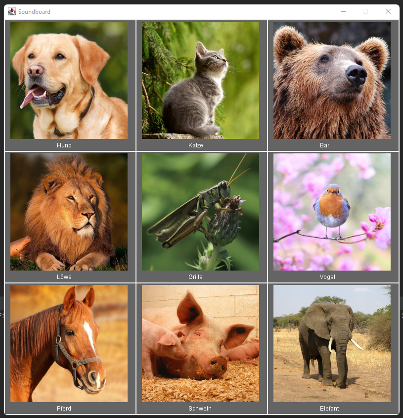

# U22-Soundboard

In dieser Aufgabe sollen Sie ein Soundboard mit Hilfe der GraphicsApp entwickeln. Das Soundboard soll es erlauben Tiergeräusche per Klick auf das Bild des Tieres oder durch Drücken des entsprechenden Anfangsbuchstabens abzuspielen.
Die Dateipfade zu den Audio- und Bilddateien sind in der abstrakten Klasse `Constants` schon gespeichert und können per `Constants.KONSTANTEN_BEZEICHNER` verwendet werden.

 - Die 9 Bilder der Tiere sollen in einem 3x3 Grid angezeigt werden. Verwenden Sie dafür die `Image`-Klasse der `GraphicsApp`-Bibliothek.
 - Unter jedem Bild soll der (deutsche) Name des Tiers stehen. Verwenden Sie dafür die `Label`-Klasse der `GraphicsApp`-Bibliothek.
 - Die Bilder und Namen sollen auf einem grauen Hintergrund zu sehen sein. Zwischen den "Karten" ist ein weißer Abstand.
 - Bei Klick auf ein Bild soll der entsprechende Sound abgespielt werden.
 - Wird der Anfangsbuchstabe eines Tiers gedrückt, wird der Sound ebenfalls abgespielt.
 - Die Sounds können mit Hilfe der `AudioClip`-Klasse der `GraphicsApp`-Bibliothek abgespielt werden.

| Soundboard Beispiel Bild |
| ------- |
|  |

Achten Sie darauf, für die Lösung der Aufgabe sinnvolle Klassen zu definieren. Die `SoundboardApp`-Klasse soll nur als Einstiegspunkt dienen und die Nutzereingaben abfangen. Die Logik und Verarbeitung der Eingaben soll in anderen Klassen realisiert werden. Achten Sie darauf nach Möglichkeit Darstellung und Programmlogik zu trennen.

Verwenden Sie auch darüber hinaus sinnvolle Datenstrukturen zur Speicherung der Soundboard Elemente. Achten Sie darauf Teilaufgaben in eigenen Methoden zu lösen und mehrfach verwendete Programmstellen in Methoden auszulagern.

Hinweis: Den ersten Buchstaben eines Strings erhält man per `s.charAt(0)`. Buchstaben können durch Verwendung der `Charakter`-Klasse in Kleinbuchstaben umgewandelt werden: 
``` java
String s = "Hallo";
char uppercaseChar = s.charAt(0);
char lowercaseChar = Chracter.toLowerCase(uppercaseChar);
```
